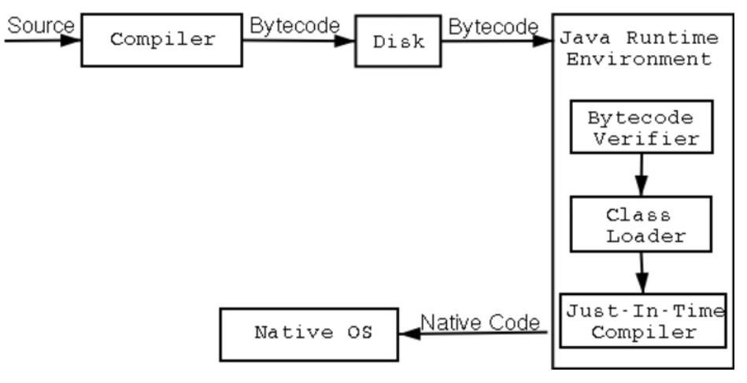
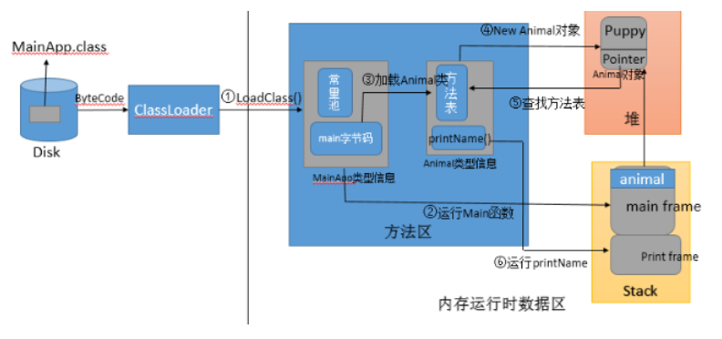

编译过程和运行过程

java整个编译以及运行的过程相当繁琐，我就举一个简单的例子说明：

Java程序从源文件创建到程序运行要经过两大步骤：

1、源文件由**编译器编译成字节码**（**ByteCode**）； 

2、字节码由java虚拟机**解释运行**。

因为java程序既要编译同时也要经过JVM的解释运行，所以说Java被称为半解释语言

（ "semi-interpreted" language）



```java
    public class Main {  
        public static void main(String[] args) {  
            Animal animal = new Animal("super_yc");  
            animal.printName();  
        }  
    }  
    class Animal{  
        private String name;
        public Animal(String name) {  
            super();  
            this.name = name;  
        }  
        public void printName(){  
            System.out.println("Animal = " + this.name);  
        }  
    }  
```

第一步（编译）：

创建完源文件之后，程序先要被JVM中的java编译器进行编译为**.class**文件。java编译一个类时，如果这个类所依赖的类还没有被编译，编译器会自动的先编译这个所依赖的类，然后引用。如果java编译器在指定的目录下找不到该类所依赖的类的.class文件或者 .java源文件，就会报"Cant found sysbol"的异常错误。

编译后的字节码文件格式主要分为两部分：**常量池和方法字节码**。常量池记录的是代码出现过的（常量、类名、成员变量等）以及符号引用（类引用、方法引用，成员变量引用等）；方法字节码中放的是各个方法的字节码。

第二步（运行）：

java类运行的过程大概分为两个步骤：（1）类的加载 （2）类的执行。

需要说明的一点的是：JVM主要在程序第一次运行时主动使用类的时候，才会立即去加载。换言之，JVM并不是在运行时就会把所有使用到的类都加载到内存中，而是用到，不得不加载的时候，才加载进来，而且只加载一次！

根据上面的程序，详解该程序运行的详细步骤：

（1）在类路径下找到编译好的 java 程序中得到 Test.class 字节码文件后，在命令行上敲** java Test**，系统就会启动一个JVM 进程，JVM进程从classpath路径下找到一个名为Test.class的二进制文件，将Test.class文件中的**类信息加载到运行时数据区的方法区**中，这一过程叫做**类的加载。（只有类信息在方法区中，才能创建对象，使用类中的成员变量）

（2）JVM 找到main方法的主函数入口， 持有一个指向当前类(Test)常量池的指针，而常量池中的第一项是发现是一个对Animal对象的符号引用，并且main方法中第一条指令是Animal animal = new Animal("super_yc")，就是让JVM创建一个Animal对象，但是方法区中还没有Animal类的类信息，于是JVM就要马上的加载Animal类，将Animal类信息放入到方法区中，于是JVM 以一个直接指向方法区Animal类的指针替换了常量池中第一项的符号引用。

（3）加载完Animal类的信息以后，JVM虚拟机就会在堆内存中为一个Animal类实例分配内存，然后调用其构造函数初始化Animal实例，这个实例持有指向方法区的Animal类的类型信息（其中包含有方发表，java动态绑定的底层实现）的引用。（animal指向了Animal对象的引用会自动的放在栈中，字符串常量"super_yc"会自动的放在方法区的常量池中，对象会自动的放入堆区）

（4）当使用 animal.pringName()的时候，JVM根据栈中animal引用找到Animal对象，然后根据Animal对象持有的引用定位到方法区中Animal类的类型信息方法表，获得pringName()函数的字节码地址，然后开始运行函数。

