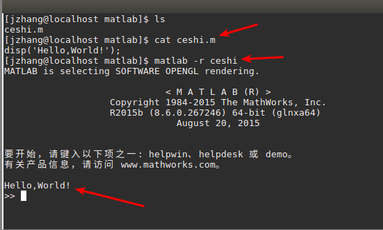
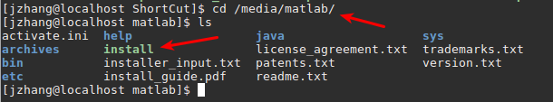
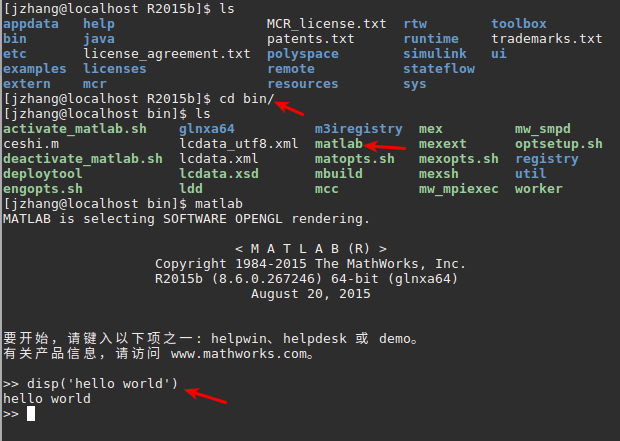

### 在无界面的centos安装matlab

>  本文安装的是 matlab R2015b  大概7.9个G左右. [下载链接](https://pan.baidu.com/s/1o8oSYCy) 连接密码(ik4r) 使用的文件和其他linux有界面版本相同

安装之后的效果:



#### 1. 挂载iso文件.

因为下载好的文件中包含三个有用的文件

-  R2015b_glnxa64.iso  (安装文件 需要挂载)
-  ShortCut_Linux.zip ()
-  Matlab 2015b Linux64 Crack.rar(激活文件)

```shell
挂载指令
$ sudo mkdir /media/matlab
$ sudo mount -o loop R2015b_glnxa64.iso /media/matlab
```

现在在/media/matlab中就能看到安装命令



#### 2. 安装

如果直接使用 `sudo ./install`就会出现两行文字然后直接finish.这时候就说明没有安装成功.

**两行字的意思是 1. 可以安装桌面环境重新安装, 2.可以使用静态安装,不用图形环境**

>  如果需要图形环境的话可以使用`VNC viewer`如果使用这个就和再ubuntu上使用是一样的提供用户界面,不过这个时候还需要再centos上安装 `VNC server`,我没有测试,这里有[参考文章](https://linux.cn/article-5335-1.html)

**我使用的是静态安装无界面的,那么程序中若使用到窗口等控件,可能就不能用.**

安装指令

```shell
sudo ./install -fileInstallationKey 09806-07443-53955-64350-21751-41297 -agreeToLicense yes -mode silent -activationPropertiesFile /home/jzhang/program/Matlab\ 2015b\ Linux64\ Crack//license_standalone.lic
```

详细解释是这样

```shell
sudo ./install -destinationFolder 安装位置 -fileInstallationKey 秘钥(如果版本一样可以使用我的这个,如果不一样看看你破解文件中的readme.txt) -agreeToLicense yes -mode silent -activationPropertiesFile (破解文件中license_standalone.lic的位置)
```

执行一分钟 就会有finish提示

我的提示是这样.

>  1。以下产品需要安装支持的编译器:
>
>  Stateflow 8.6
>  Simulink Coder 8.9
>  MATLAB Coder 3.0
>  Simulink Test 1.1
>
>  2。Simulink 需要使用 C 编译器以实现仿真加速、模型引用和 MATLAB 函数块功能。建议在您的计算机上安装支持的编译器。
>
>  3。要加快以下产品的计算速度，需要安装支持的编译器:
>
>  SimBiology 5.3
>  Fixed-Point Designer 5.1
>
>  4。此安装完成后，应按照从 www.mathworks.com/distconfig 获取的说明中所述继续配置 MATLAB Distributed Computing Server。
>
>  5。MATLAB Compiler SDK 6.1 要求安装以下程序: 
>
>   ●  支持的编译器，用于创建 C 和 C++ 共享库
>   ●  Java JDK，用于创建 Java 包
>
>  (十一月 29, 2017 09:41:09) Exiting with status 0
>  (十一月 29, 2017 09:41:12) End - Successful.

**如此便是安装成功**

如果你自定义路径则安装了你的自定义路径,如果没就安装到了`/usr/local/MATLAB/R2015b`

这个时候你就可以测试 是不是安装成功了.

进入 bin执行




#### 3. 安装破解文件

激活	

把破解文件中`/Matlab 2015b Linux64 Crack/R2015b/bin/glnxa64`下面的三个文件全部拷贝到安装文件对应的位置

```shell
sudo cp /home/jzhang/matlab_install_program/Matlab 2015b Linux64 Crack/R2015b/bin/glnxa64/* /usr/local/MATLAB/R2015b/bin/glnxa64/
```

拷贝licenses文件

```shell
mkdir licenses
sudo cp /home/jzhang/matlab_install_program/Matlab 2015b Linux64 Crack/license_standalone.lic /usr/local/MATLAB/R2015b/licenses/
```


#### 4. 建立全局软连接 卸载iso

现在的matlab 只能再`/usr/local/MATLAB/R2015b/bin`下面运行,需要把他改为全局的使用软连接的方式

```shell
sudo ln -s /usr/local/MATLAB/R2015b/bin/matlab /usr/local/bin/matlab
```

```shell
sudo ln -s 原位置 /usr/local/bin/matlab
```

卸载

```shell
sudo umount /media/matlab
```


参考目录

[Matlab2016 linux安装](https://zhuanlan.zhihu.com/p/23633624)

[Linux Debian8 x64下安装Matlab 2015b](http://www.linuxidc.com/Linux/2017-03/142290.htm)

[VNC服务器安装](https://linux.cn/article-5335-1.html)