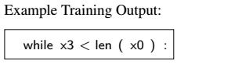

[TOC]

## 一 : Overview

### 1. Renaming Variables(重命名变量)

整篇文章是按句为单位，作者认为每一句代码再语法上是一串令牌环（token）。

按照顺序替换变量名

### 2. Forming Partial Fragments(形成代码片段)

划分代码段，把连续的三行代码认为是一个代码段。

### 3. Predicting Statements from Partial Fragments(训练模型和预测)

#### 3.1 Training(训练)

对代码段中的三行代码抽取某一行，得到一个残缺的代码段，把残缺的代码段作为输入，缺少的哪一行作为lebel，这样去用seq2seq网络进行训练。

**input** : 缺少某一行的代码片段

**labels** : 缺少的哪一行代码      

#### 3.2 StatementPrediction Model(语句预测模型)

模型的训练是继续两种两种网络

-   seq2seq network：多用于机器翻译和自然语言处理,再`LSTM`的基础上添加了更适合代码翻译的 encoder  和 decoder

本文中所有的网络是继承了seq2seq network,再他的基础上对encoders做了变化.

#### 3.3 Candidate Statement Generation(生成待选代码句)

通过模型输出是残缺的句子出现概率的top3。

输入：                                                

TOP3的输出和对应出出现的概率：

​          正确                                          输入                                                  输出

### 4. Finding a Candidate Program(寻找候选代码)

通常对原始代码中的每一句都进行高概率替换，不过对于第一句和第二句一般不会替换。

#### 4.1 Space of Candidate Programs(候选代码空间)

为了组成候选代码，sk_p通常会**同时替换**原始代码中的**每一句**（包括插入和删除）。

再替换的时候空缺代码段 **原始位置的句子** 也是一个候选项，当预测概率都非常低的时候，会选择**原始位置的句子**

#### 4.2 Distribution of Candidate Programs(候选代码分配)

**整个候选代码的概率**是代码中**每一句的概率**的**乘积**

然后按照**概率**对预测出来的代码进行验证，知道出现通过的代码为止，替换所有的变量反馈给用户。

***

## 二  :　Correction Model

文中的方法修复程序是通过对**每一行代码**更改、插入或者删除。

修改模型。

***

## 三  ：Statement Prediction Model

### 1. Generating Training Fragments

收集样本的时候先对要训练的样本按照下面的几条规则进行筛选

-   行的数量不能超过给定值
-   每行的单词个数不能超过给定值
-   单词（替换过的）都需要是给定数据集中的。

训练集中要准确两种模型

1.  两个连续的句子中插入空，对应的label就是空
2.  三个连续的句子中拿出中间的哪一行，第一行和第三行作为样本，第二行作为label。

### 2. Neural Network Model

#### Tokenization and Variable Renaming（令牌环和变量改名）

文中认为每个句子包含`关键字` `标识符` `操作符`  改名只针对的是变量名,不包含关键字,标识符,和操作符.

#### RNN and LSTM

修改过的LSTM.

#### Encoder Decoder Model

所谓编码，就是将输入序列转化成一个固定长度的向量；解码，就是将之前生成的固定向量再转化成输出序列

***

## 四 : Generating Candidate Programs